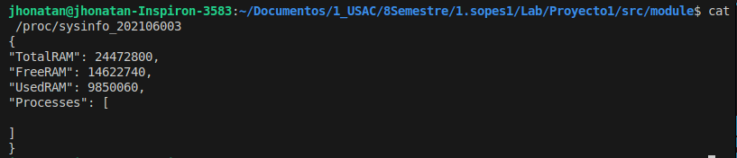
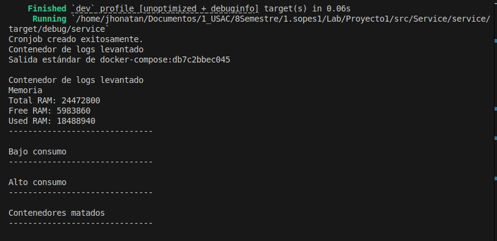
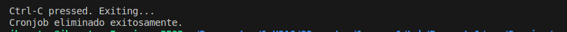
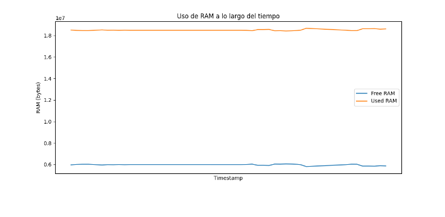
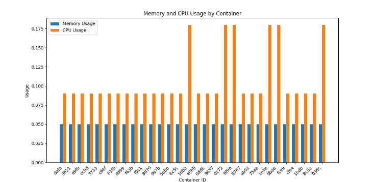

# PROYECTO 1

Este es el proyecto 1 del curso de Sistemas operativos de la Universidad de San Carlos de Guatemala.

Este proyecto se divide en varias partes, la parte inicial consiste en crear un modulo en el lenguaje C que sea capaz de crear un modulo con informacion de la memoria y uso del cpu en un formato json. La segunda parte consiste en crear un servicio de rust el cual sera una gestor de contenedores, este servicio crea un cronjob que ejecuta un script cada 60 segundos, el script se encarga de crear 10 contenedores de 4 imagenes diferentes. 

Posterior a esto el servicio rust se encarga de levantar un docker-compose el cual se encarga de levantar un servicio en python con FastAPI crear un json compartido, esto se logra al hacer uso de volumenes. 
Despues de crear el crontab y levantar el docker-compose, el servicio de rust pasa a un analizador que se encargara de eliminar los contenedores dejando 2 de alto comsumo, 3 de bajo consumo y el contenedor que contiene el servicio de python y este analizador se ejecuta cada 10 segundos.

 La parte final de este proyecto consiste en el servicio de python con FastAPI, este servicio se encargara de recibir logs en formato json y posteriormente realizar graficas con estos datos, los logs son de los contenedores eliminados y de la memoria ram y sus variaciones durante la ejecucion del proyecto. 

# MODO DE USO

Para poder ejecutar este proyecto primero debemos crear el modulo e instalarlo en nuestra computadora, para esto se hizo uso del paquete Make(debe de instalarse)
```bash
    sudo apt install build-essential
```
Se ejecuta el comando make en el directorio donde esta el archivo Makefile y el modulo en C, esto compilara el codigo en C y quedara listo para instalar el modulo. Para instalar el modulo se debe de ejecutar el siguiente comando 
```bash
sudo insmod sysinfo.ko
```
Se puede ejecutar el comando **cat /proc/sysinfo_202106003** para poder visualizar la estructura del json que contendra toda la informacion de los procesos. 




Para levantar el servicio de rust solo es necesario tener instalado rust y cargo para ejecutar e instalar todo lo necesario, para levantar el proyecto ejecuta este comando en la Carpeta **src/Service/service/src/** 
```bash
cargo run
```
Al ejcutar el comando anterior se debera de visualizar algo similar a: 



con esto el servicio de rust se levanta crea contenedores, elimina los excesos de contenedores, manda los logs de los contenedores eleminados al servicio de python y al finalizar el servicion con **Ctrl + C** Se generan graficas de los logs enviados y se elimina el cronjob que se encarga de generar los contenedores aleatorios.


Las imagenes que se generar el detener el servicio se encuentrar en la carpeta images y se pueden visualizar similar a estas: 



