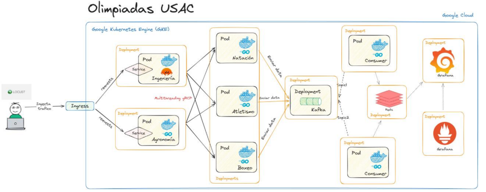

# 🏅 Olimpiadas USAC - Sistema de Monitoreo en Tiem Real

## 📌 Descripción
Sistema distribuido en Kubernetes (GCP) para monitorear en tiempo real las competencias de Natación, Boxeo y Atletismo entre las facultades de Ingeniería y Agronomía. Utiliza Grafana para visualización y Kafka para streaming de datos.

---

## 🏗️ Arquitectura

### Componentes Principales:
1. **Locust** 🌪️  
   - Generador de tráfico HTTP con Python.
   - Envía 10,000+ solicitudes/sec en formato JSON:
     ```json
     {
       "faculty": "Ingeniería|Agronomía",
       "discipline": 1|2|3  // 1: Natación, 2: Atletismo, 3: Boxeo
     }
     ```

2. **Servidores de Facultades** ⚙️  
   - **Ingeniería**: Contenedor en Go (Goroutines + Channels + gRPC).
   - **Agronomía**: Contenedor en Rust (Threads + gRPC).
   - Autoescalado horizontal (HPA) basado en carga.

3. **Servidores de Disciplinas** 🏊♂️🥊🏃♂️  
   - Contenedores en Go.
   - Algoritmo de probabilidad (lanzamiento de moneda).
   - Publica resultados en Kafka (tópicos: `winners` y `losers`).

4. **Kafka** 📡  
   - Tópicos: `winners` y `losers`.
   - Implementado con Strimzi.

5. **Consumidores + Redis** 💾  
   - Procesan mensajes en paralelo.
   - Almacenan datos estructurados en Redis (hashes).

6. **Grafana + Prometheus** 📊  
   - Dashboards en tiempo real:
     - Conteo por facultad/disciplina.
     - Monitoreo de cluster (CPU, memoria, pods).

---

## 🛠️ Tecnologías Clave
| Componente          | Tecnologías                                                                 |
|---------------------|-----------------------------------------------------------------------------|
| Infraestructura     | GCP, GKE, Kubernetes, Helm                                                 |
| Lenguajes           | Go (servidores), Rust (servidores), Python (Locust)                        |
| Comunicación        | gRPC, HTTP/HTTPS, Kafka                                                    |
| Almacenamiento      | Redis                                                                       |
| Monitoreo           | Prometheus, Grafana                                                        |
| Autoescalado        | Horizontal Pod Autoscaler (HPA)                                            |

---